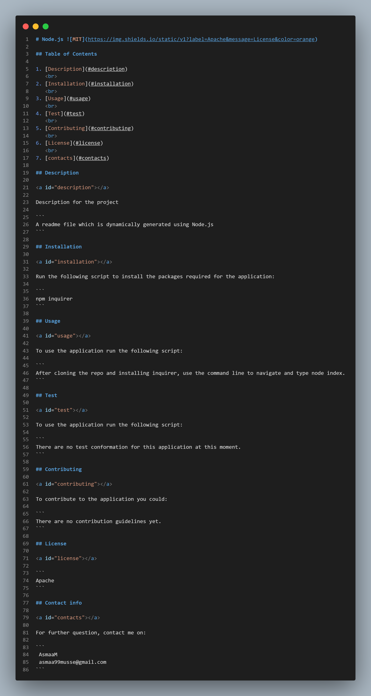

# Readme Generator 

## Overview

For this project, I dynamically generate a readme using node javascript.

Demo Video: https://drive.google.com/file/d/17Q2iQHGY02wJAZZYZrEcEgBCONs7L5Hx/view?usp=sharing

Github page: https://github.com/AsmaaMusse/readme-generator/tree/dev

## What did i do

I created a command-line application that dynamically generates a professional README.md file from the user's input using the Inquirer package.

## Technologies used:

- Javascript
- JQuery
- Node.js

## Screenshots:

Index.js:

Readme:

## Contribute

To contribute or ask questions, please <a href="https://mail.google.com/mail/u/0/?tf=cm&to=asmaamusse03@gmail.com&cc&bcc&su&body&fs=1">Email</a> here
